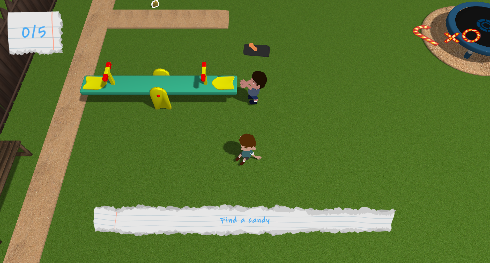
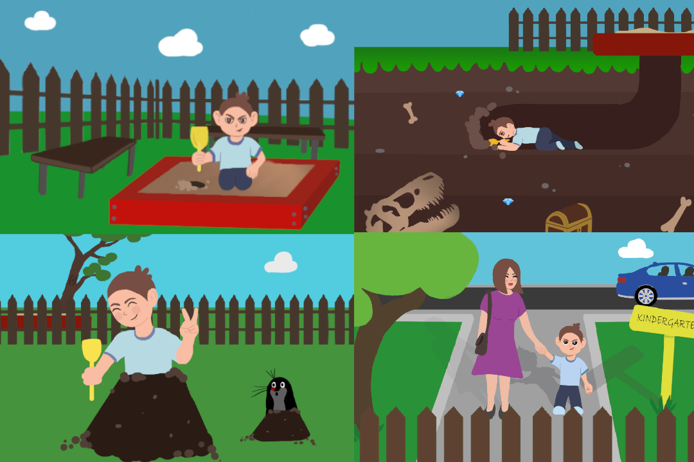
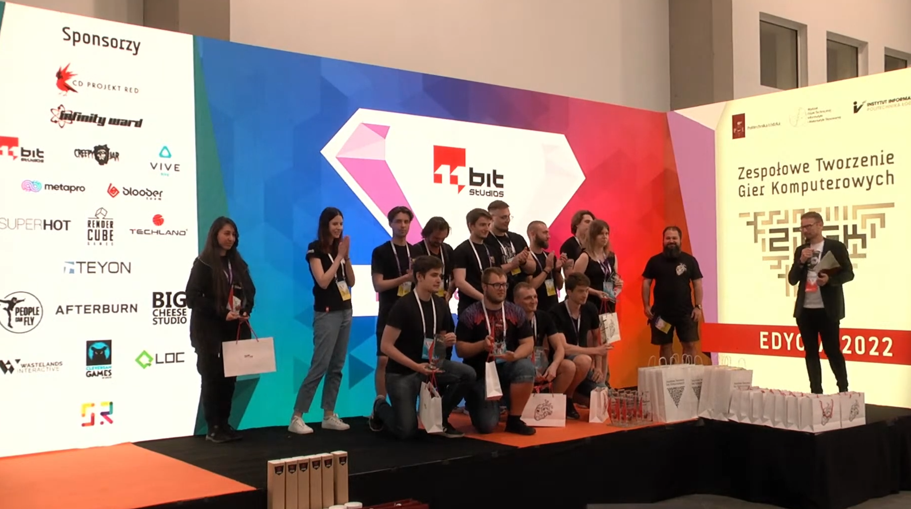

# Playground Escape
## Game on own engine using OpenGL,C++,assimp,irrKlang

Playground can give a lot of excitements, especially to preschooler. To a normal preschooler... Solve puzzles and find scenarios of escaping from playground. Can you do it before day ends?





Engine was created using Visual Studio 2022. It works on debug x64. Dependencies should be already inside. If they aren't go to
 Properties>VC++ directories>Library directories. Copy paste this:
```sh
PATH=%PATH%;$(SolutionDir)Libraries\lib
```
 Properties>VC++ directories>Include directories. Copy paste this:
```sh
PATH=%PATH%;$(SolutionDir)Libraries\include
```
 Properties>VC++ directories>Enviroment. Copy paste this:
```sh
PATH=%PATH%;$(SolutionDir)Libraries\DLL\
```
 Properties>Linker>Input>Additional dependecies. Copy paste this:
```sh
glfw3.lib
opengl32.lib
assimp-vc143-mtd.lib
freetype.lib
irrKlang.lib
OpenAL32.lib
```

## Authors
Michał Jemiołek:
- Shadow Mapping (PCF sampling)
- Collisions (Box and spheres, colliders and triggers)
- Physics (Gravitation and resolving collisions)
- Lighting (Directional, Phong)
- Frustum Culling
- Optimalization for static and dynamic collisions
- Water shader (water created with frame buffer objects)
- Ball mechanic

Wojciech Cwynar:
- Camera
- Movable objects
- Optimalization of ball mechanic
- GUI (Displaying stories,Gui.h class)
- Storytelling and creative work

Marcin Baryczka:
- Game loop
- Scene Graph
- Loading Models
- Tutorial
- Loading and playing animations

Łukasz Biechoński:
- Interaction with kids
- Sounds
- Antyaliasing

Julia Dłubak:
- Characters and character animations

Milena Pawlak:
- Models and textures
- Comics

## Extras

Our game got prize for the smartest way of resolving technological problems from 11bit studios at 14 edition of ZTGK contest. ZTGK is polish contest for team development of computer games.



## License CC BY-NC 3.0 PL